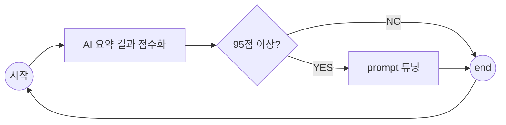

# caring-note prompt tunner

## Prompt tuning workflow



## AI 요약 결과 점수화 방향성

### 가설 1

#### 가설

* 사용자(약사)가 중재기록으로 남긴 Text 내용이 사용자가 원하는 요약 방향이다.

#### 가설 검증

* 2025.05.03 기준으로 DB에 쌓인 중재 기록을 분석

  * 확인한 내용

    * Bold(highLight) 기능 별로 사용하지 않아 중요 키워드 선별은 어려움
    * 중재 기록에서 중요 키워드 뽑아 내야함.

  * 중재기록과 AI요약 결과간에 유사도 비교

    ```mermaid
    flowchart LR
        A[정제한 DataFrame] --> B[LangChain Embedding]
        B --> C[Cosine 유사도 계산]
        C --> D[유사도 점수 DataFrame화]
    ```

    * 중재기록과 AI요약 결과 둘다 있는 경우(36)에 대해서 유사도 비교

      * 우수의 경우 사용자(약사)가 AI 요약 결과를 복붙한 케이스
      * 보통의 경우 대부분 사용자(약사)가 중재기록을 상세하게 작성한 케이스이며
        AI 요약 결과와 포맷이 다른데도 0.5 이상 나왔다는 건 비슷한 주제와 내용을 다뤘다는 걸 의미한다.
      * 미흡의 경우 약물명이 많아 STT/TA 과정에서 제대로 안잡힌경우 및 할루시네이션 케이스도 보인다.

      | 분류          | 건수 |
      | ------------- | ---- |
      | 우수(>= 0.75) | 3    |
      | 보통(>= 0.5)  | 18   |
      | 미흡          | 15   |

#### 결론

>  이번 분석 결과, 중재기록과 AI 요약 결과가 유사도 기준 0.5 이상인 경우가 전체의 58.3%에 해당했으며,
> 유사도만으로 중재기록이 사용자의 의도 자체를 “정확히 대변”한다고 확정할 수는 없으나,
> 일정 수준 이상의 유사도가 다수 존재하는 것으로 보아 중재기록을 사용자 의도의 대략적인 proxy(대리 변수)로 활용할 수 있는 가능성이 충분함.
> 다만, 향후 더 정밀한 검증(예: 설문, 인터뷰, 실제 사용자 피드백)이 필요함.

* 참고
  * [분석내용](./analysis/counselsession/analysis_counsel_session.ipynb)


## Prmpt 튜닝 방향성


