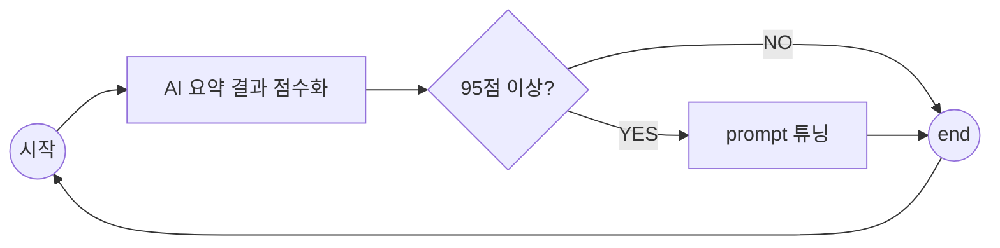

# caring-note prompt tunner

## Prompt tuning workflow

## AI 요약 결과 점수화 방향성

### 가설 1

#### 가설

* 사용자(약사)가 중재기록으로 남긴 Text 내용이 사용자가 원하는 요약 방향이다.

#### 가설 검증 전 사전 분석

##### Step1

* 2025.05.03 기준으로 DB에 쌓인 중재 기록을 분석해보자

## Prmpt 튜닝 방향성

